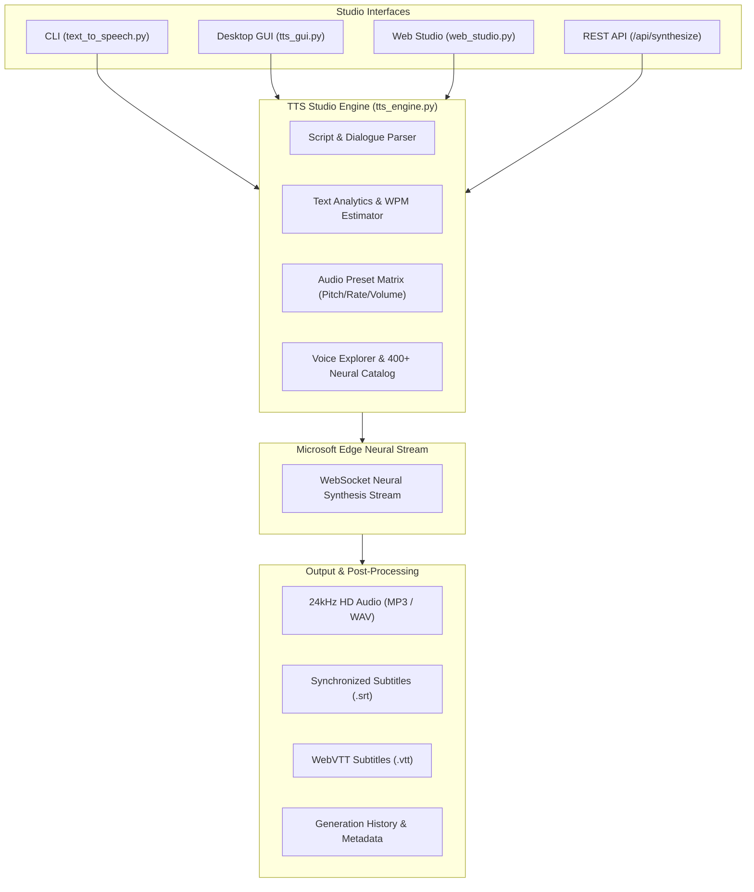
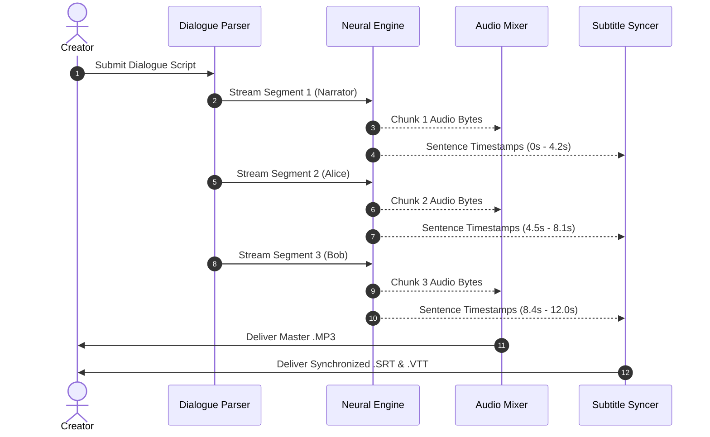

<div align="center">

# TEXT TO SPEECH STUDIO v2.0
### *Next-Gen Neural AI Voice & Dialogue Creation Suite*

**Zero API keys. Zero subscriptions. 400+ Studio-Grade Neural Voices. 100% Free & Unlimited.**

[](https://www.python.org/)
[](LICENSE)
[](#features)
[](#curated-presets)
[](#quickstart)
[](https://github.com/taezeem14/text-to-speech-studio/pulls)

<br/>

```text
  ████████╗████████╗███████╗    ███████╗████████╗██╗   ██╗██████╗ ██╗ ██████╗ 
  ╚══██╔══╝╚══██╔══╝██╔════╝    ██╔════╝╚══██╔══╝██║   ██║██╔══██╗██║██╔═══██╗
     ██║      ██║   ███████╗    ███████╗   ██║   ██║   ██║██║  ██║██║██║   ██║
     ██║      ██║   ╚════██║    ╚════██║   ██║   ██║   ██║██║  ██║██║██║   ██║
     ██║      ██║   ███████║    ███████║   ██║   ╚██████╔╝██████╔╝██║╚██████╔╝
     ╚═╝      ╚═╝   ╚══════╝    ╚══════╝   ╚═╝    ╚═════╝ ╚═════╝ ╚═╝ ╚═════╝ 
```

**Built different.** Turn any script, book, article, or dialogue into ultra-realistic voiceovers with synchronized subtitles in milliseconds.

[Quickstart](#quickstart) • [Features](#key-features) • [Dialogue Studio](#multi-speaker-dialogue-lab) • [Presets](#curated-studio-presets) • [Web & Desktop UI](#three-powerful-interfaces) • [REST API](#developer-rest-api)

</div>

---

## Benchmark: Why TTS Studio Hits Different

| Feature / Metric | **TTS Studio v2.0** | **ElevenLabs** | **OpenAI TTS** | **AWS Polly** | **Google Cloud TTS** |
| :--- | :---: | :---: | :---: | :---: | :---: |
| **Cost** | **$0.00 (Free Forever)** | $5 – $330+/mo | $0.015 / 1k chars | Pay-per-char | Pay-per-char |
| **API Keys / Credit Card** | **Zero / No Account** | Required | Required | Required | Required |
| **Voice Count** | **400+ Neural HD** | Custom / Limited | 6 Voices | ~60 Voices | ~100 Voices |
| **Word-Synced Subtitles** | **Auto SRT & VTT** | Extra Cost/API | No | Complex JSON | Extra Config |
| **Multi-Speaker Scripts** | **Native Dialogue Mixer** | Manual Stitching | No | No | No |
| **Interfaces Included** | **Web + Desktop GUI + CLI** | Web Only | API Only | AWS Console | GCP Console |
| **Setup Time** | **< 30 seconds** | 5 mins | 5 mins | 20 mins (IAM) | 20 mins (IAM) |

---

## Key Features

- **400+ Studio Neural Voices**: Broadcast-grade speech synthesis across 100+ global languages & dialects (US, UK, Hindi, Japanese, Spanish, French, German, and more).
- **Word-Perfect Synchronized Subtitles**: Automatically extracts sentence and word boundary timestamps to generate ready-to-use `.srt` and `.vtt` subtitle files for video editing (Premiere, CapCut, DaVinci, Final Cut).
- **Multi-Speaker Dialogue Lab**: Write complex conversation scripts (`[Narrator]: ... [Alice]: ... [Bob]: ...`) and compile them into a seamless master dialogue track with individualized voices and custom pauses.
- **Curated Creator Presets**: One-click audio presets optimized for TikToks, YouTube Shorts, True Crime Podcasts, Movie Trailers, ASMR, and Anime Dubs.
- **Real-Time Text Analytics**: Live calculation of word count, character count, estimated speaking duration, and reading complexity grade.
- **Three Unified Interfaces**:
  1. **Glassmorphism Web Studio** with real-time Web Audio API frequency visualizer.
  2. **Dark-Themed Desktop GUI** with dynamic animated waveform canvas.
  3. **Supercharged Rich CLI** with JSON mode, batch folder processing, and automation scripting.
- **Zero Dependencies on External Cloud APIs**: No credit cards, token limits, rate limit paywalls, or billing shocks.

---

## Architecture & Pipeline



---

## Quickstart

### 1. Installation

```bash
# Clone the repository
git clone https://github.com/taezeem14/text-to-speech-studio.git
cd text-to-speech-studio

# Install dependencies (Python 3.10+)
pip install -r requirements.txt
```

### 2. Launch the Studio

Choose your preferred way to work:

#### Option A: Web Studio (Browser Edition)
```bash
python web_studio.py
# Or on Windows, double click start_web.bat
```
*Opens an interactive glassmorphism web workstation at `http://localhost:7860` with real-time visualizers, script creators, and downloads.*

#### Option B: Desktop Studio (Native GUI)
```bash
python tts_gui.py
# Or on Windows, double click start_gui.bat
```
*A responsive dark-themed desktop suite with waveform audio canvas, dialogue lab, batch queue, and history manager.*

#### Option C: Powerful CLI
```bash
# Instant voiceover with synchronized subtitles
python text_to_speech.py "This is Text to Speech Studio v2.0." --srt

# Apply a TikTok creator preset to a text file
python text_to_speech.py --file script.txt --preset tiktok --srt

# Compile a multi-speaker dialogue conversation
python text_to_speech.py --dialogue sample_dialogue.txt --output podcast_ep1.mp3
```

---

## Multi-Speaker Dialogue Lab

Create multi-character audiobooks, gaming dialogues, and podcast discussions effortlessly.

### Script Syntax
Save your script as a `.txt` file (e.g. [`sample_dialogue.txt`](sample_dialogue.txt)):

```text
[Narrator | en-US-ChristopherNeural]: In a world where AI speech was expensive, a new studio emerged.
[Alice | en-US-JennyNeural | rate=+5%]: Hey Bob! Did you see how realistic these voices sound?
[Bob | en-US-GuyNeural | rate=+0% | pitch=-4Hz]: Not only that, Alice! It generates word-synced subtitles automatically.
[Narrator | en-US-ChristopherNeural]: Text to Speech Studio v2.0. Uncapped. Free forever.
```

### Compile to Audio + Subtitles:
```bash
python text_to_speech.py --dialogue sample_dialogue.txt --output epic_scene.mp3
```

**Output Generated:**
- `epic_scene.mp3`: Master combined audio with natural speaker transitions.
- `epic_scene.srt`: Timestamped subtitles with speaker badges (`[Alice]`, `[Bob]`).
- `epic_scene.vtt`: WebVTT format for browser video players.



---

## Curated Studio Presets

Apply tuned voice parameters with `--preset <id>` or select them in the Web / Desktop GUI:

| Preset ID | Style Name | Recommended Voice | Rate | Pitch | Best For |
| :--- | :--- | :--- | :---: | :---: | :--- |
| `tiktok` | **TikTok / Reel Narrator** | `en-US-AvaNeural` | `+15%` | `+0Hz` | Viral shorts, TikToks, fast hook reels |
| `podcast` | **Podcast Host** | `en-US-ChristopherNeural` | `+0%` | `-5Hz` | Deep broadcast, interviews, tech talks |
| `storyteller` | **Audiobook Storyteller** | `en-GB-SoniaNeural` | `-5%` | `+0Hz` | Fiction, lore videos, British narration |
| `trailer` | **Epic Movie Trailer** | `en-US-GuyNeural` | `-12%` | `-18Hz` | Heavy cinematic teasers, gaming trailers |
| `calm_asmr` | **Meditative Calm / ASMR** | `en-US-JennyNeural` | `-20%` | `-4Hz` | Sleep stories, mindfulness apps |
| `news_anchor`| **Breaking News Anchor** | `en-US-EricNeural` | `+6%` | `+0Hz` | Professional summaries, documentary |
| `anime_upbeat`| **Anime Energetic** | `en-US-AriaNeural` | `+18%` | `+16Hz`| Gaming characters, anime commentary |
| `cyberpunk_ai`| **Sci-Fi AI / Cyberpunk** | `en-US-AnaNeural` | `+10%` | `+22Hz`| System assistants, robotic voices |
| `hindi_rj` | **Hindi Radio Host** | `hi-IN-MadhurNeural` | `+6%` | `+0Hz` | Hindi / Hinglish podcasts and videos |
| `spanish_latam`| **Spanish Narration (LatAm)** | `es-MX-JorgeNeural` | `+0%` | `+0Hz` | Spanish storytelling & documentaries |
| `japanese_anime`| **Japanese Tokyo Voice** | `ja-JP-NanamiNeural` | `+5%` | `+8Hz` | Japanese anime dialogue & narration |

---

## CLI Reference & Cheat Sheet

```bash
# 1. Basic text synthesis
python text_to_speech.py "Hello, welcome to my channel!"

# 2. Text file with preset and subtitles
python text_to_speech.py --file narration.txt --preset podcast --srt

# 3. Custom voice tuning (Rate, Pitch, Volume)
python text_to_speech.py --text "Warning: System failure." --voice en-US-AnaNeural --rate +10% --pitch +20Hz --volume +15%

# 4. Filter & audition voices
python text_to_speech.py --list-voices --locale en-US --gender Female
python text_to_speech.py --sample --voice en-US-AvaNeural

# 5. Batch process an entire folder of scripts
python text_to_speech.py --batch "scripts/*.txt" --output-dir audio_out/ --preset tiktok --srt

# 6. Analyze text metrics without synthesizing
python text_to_speech.py --file book_chapter.txt --stats

# 7. Output machine-readable JSON (for pipelines & CI/CD)
python text_to_speech.py "Automated status update" --json
```

### CLI Arguments Summary

| Option | Flag | Description | Default |
| :--- | :--- | :--- | :--- |
| `text` | Positional | Input text string | — |
| `--file` | `-f` | Path to text / markdown file | — |
| `--output` | `-o` | Output audio destination | `auto-generated` |
| `--voice` | `-v` | Voice ID (see `--list-voices`) | `en-US-ChristopherNeural` |
| `--preset` | — | Apply audio preset (`tiktok`, `podcast`, etc.) | — |
| `--rate` | `-r` | Speaking speed (`-50%` to `+100%`) | `+0%` |
| `--pitch` | `-p` | Pitch shift (`-50Hz` to `+50Hz`) | `+0Hz` |
| `--volume` | — | Volume modifier (`-50%` to `+50%`) | `+0%` |
| `--srt` | — | Generate synchronized `.srt` subtitle file | `False` |
| `--vtt` | — | Generate synchronized `.vtt` subtitle file | `False` |
| `--dialogue`| `-d` | Path to multi-speaker script file | — |
| `--batch` | — | Glob pattern for batch conversion | — |
| `--list-voices`| — | Browse 400+ neural voices directory | — |
| `--list-presets`| — | View all studio presets | — |
| `--sample` | — | Generate audition test sample | — |
| `--stats` | — | Output text readability and duration stats | — |
| `--json` | — | Output JSON format for automation | `False` |

---

## Developer REST API

Start the Web Studio server with `python web_studio.py` to access built-in REST API endpoints:

### Synthesize Speech:
```bash
curl -X POST http://localhost:7860/api/synthesize \
  -H "Content-Type: application/json" \
  -d '{"text": "Hello world from the REST API!", "voice": "en-US-AvaNeural", "rate": "+10%", "subtitles": true}'
```

**JSON Response:**
```json
{
  "success": true,
  "audio_url": "/static/hello_world_from_the_20260815_143000.mp3",
  "srt_url": "/static/hello_world_from_the_20260815_143000.srt",
  "vtt_url": "/static/hello_world_from_the_20260815_143000.vtt",
  "duration_sec": 2.45,
  "words": 6
}
```

### Python SDK Integration:
```python
import asyncio
from tts_engine import TTSStudioEngine

engine = TTSStudioEngine()

async def main():
    # 1. Synthesize audio with auto-generated SRT subtitles
    result = await engine.synthesize(
        text="Text to Speech Studio in pure Python!",
        voice="en-US-ChristopherNeural",
        rate="+5%",
        generate_subtitles=True
    )
    print(f"Audio saved to: {result.audio_path}")
    print(f"Subtitles saved to: {result.srt_path}")

    # 2. Synthesize multi-speaker conversation
    dialogue_script = """
    [Narrator]: Welcome to the future.
    [Alice]: It feels like magic.
    """
    d_res = await engine.synthesize_dialogue(dialogue_script)
    print(f"Dialogue saved to: {d_res.audio_path}")

asyncio.run(main())
```

---

## Project Architecture

```
text-to-speech-studio/
├── tts_engine.py        # Core Async Neural Engine & Subtitle Syncer
├── tts_gui.py           # Dark-Themed Desktop Workstation (Tkinter + Visualizer)
├── web_studio.py        # Standalone Glassmorphism Web Studio (HTML5/Audio API)
├── text_to_speech.py    # Supercharged Automation CLI & Terminal Interface
├── sample_dialogue.txt  # Example Multi-Speaker Conversation Script
├── test_studio.py       # Automated Unit & Integration Test Suite
├── start_gui.bat        # 1-Click Desktop GUI Launcher (Windows)
├── start_web.bat        # 1-Click Web Studio Launcher (Windows)
├── requirements.txt     # Dependencies & Optional Enhancements
├── README.md            # Documentation & Feature Guide
└── LICENSE              # MIT Open Source License
```

---

## Contributing

Contributions make the open-source community an amazing place to build and create!
1. Fork the Project
2. Create your Feature Branch (`git checkout -b feature/AmazingVoiceFeature`)
3. Test your changes (`python test_studio.py`)
4. Commit your Changes (`git commit -m 'Add awesome new feature'`)
5. Push to the Branch (`git push origin feature/AmazingVoiceFeature`)
6. Open a Pull Request

---

## License

Distributed under the **MIT License**. See [`LICENSE`](LICENSE) for more details.

<div align="center">
  <sub>Built for creators, developers, and voice artists. Free and open source forever.</sub>
</div>
